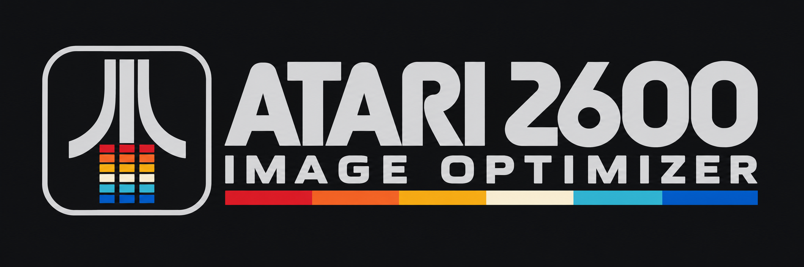

# Atari 2600 Image Optimizer



A Python desktop workbench for turning pictures into **NTSC Atari 2600 cartridge images**. This continues Chris Martin's 2011 Chrono2 converter, using Andrew Davie's original Interleaved Chronocolour display kernel and separate new scanline kernels.

The **0.5.0 release** simplifies the GUI, adds source crop zoom, and provides twenty output modes. All modes now share linear-light blending and CIEDE2000 color matching. New choices are **Hybrid playfield + sprites — Static**, **96-pixel interleaved bitmap — Flicker**, and **Television interlace (experimental) — Flicker**. See [ADVANCED-MODES.md](ADVANCED-MODES.md) for formats, hardware limits, provenance, verification and the proposed ultimate-mode design.

Version **0.5.1** adds the shared logo and Windows icon to the workbench and About window. Image conversion and output formats are unchanged.

## Run

**Windows standalone:** download `Atari-2600-Image-Optimizer-v0.5.1-Windows-x64.zip`, extract the entire folder, and run `Atari-2600-Image-Optimizer.exe`. Keep `_internal` alongside the EXE. Python and the image libraries are included; no Python installation is required. This is an unsigned portable Windows x64 build.

BUS, DPC+ and CDFJ+ exports need their optional upstream cartridge support. Run the included **Setup cartridge support.cmd**, then click **Download cartridge support** once. The pinned files are checksum-verified and cached under `%LOCALAPPDATA%/RetroComputerist/Atari2600ImageOptimizer/drivers`. Other modes and previews work offline immediately. Stella is a separate installation.

**Python source package:**

On Windows, double-click **Run Atari 2600 Image Optimizer.cmd**. Python 3.12 or newer with Tkinter is required. The first run creates `.venv`, installs NumPy and Pillow, and retrieves BUS, DPC+ and CDFJ+ cartridge support directly from the original upstream sources. These downloads require Internet access and are verified against pinned checksums. Later runs use the cached support files. No external assembler is required for export. The Source ZIP is for Python users; the separate Windows x64 ZIP includes the runtime.

Alternatively:

```text
python -m venv .venv
.venv\Scripts\python -m pip install -r requirements.txt
.venv\Scripts\python run.py
```

Pass an image path to `run.py` or drop it onto the launcher. The application starts with an original calibration image when no file is supplied.

## Image workflow

1. Open PNG, JPEG, BMP, GIF, TIFF or WebP. Animated inputs use their first frame; transparency is composited over black. EXIF orientation is honored.
2. Select an output mode. Its dimensions and Static/Flicker behavior appear directly below the selector.
3. Choose Fill / crop (default), Fit, or Stretch. Use **Crop zoom** above the input (1×–8×) to select a smaller source area, then drag the adjusted input to position it. Stretch fills the output and ignores aspect ratio, including when zoomed.
4. Adjust brightness, contrast and saturation. Advanced image adjustments contain gamma, sharpness, RGB gains, rotation, mirror and geometry. Resampling includes nearest, box, bilinear, Hamming, bicubic and Lanczos.
5. Choose colors and dithering. Ordinary image and dither edits refresh the preview with the existing palette. A new image or output mode initializes any required per-row palettes once.
6. Select **Image + colors**, **Image only**, or **Colors only**, then press **Optimize**. The explanatory line says exactly what may change.
7. Compare before/after and Undo optimization. Use ATARI Rendering Preview or Open in Stella, then Export. File contains settings, PNG preview, slowed frame GIF and Stella location commands.

### Crop zoom and view size

**Crop zoom** changes the source selection used by conversion, optimization and export. At 2×, each dimension of the selected source region is half its 1× size. Fill / crop also matches the target aspect; Fit letterboxes the selection; Stretch resizes it independently on both axes. Crop position is measured after rotation and mirror, clamped to the source edges, and saved with settings.

Drag **Adjusted input** to reposition the selection. **Center** centers the current selection; **Reset crop** returns to 1× and centers it. Opening another image resets the crop. **Reset image adjustments** resets tone/RGB/sharpness without losing the crop. **Original input** shows the full unadjusted source for reference; switch back to Adjusted input to drag the crop.

**View size** magnifies the on-screen preview only; it does not change the exported image. Shift-drag pans the enlarged input view. Output dragging also pans. Original input, adjusted input and Atari output are separate views. Comparing before optimization is read-only: exports always use the current result unless Undo restores the earlier conversion.

### Optimization scope

| Scope | Changes | Preserves |
| --- | --- | --- |
| Image + colors | Tone/RGB controls and legal palette | Mode, crop, resampling, dither, sharpness |
| Image only | Brightness, contrast, gamma, saturation and RGB gains | Current palette and image geometry |
| Colors only | Legal palette for the selected mode | All image adjustments and geometry |

Picking a preset or applying manual colors selects **Image only**, so the next optimization respects that choice. Switching explicitly to a scope containing colors permits replacement. Classic RGB and BUS offer Image only because their available color sets are fixed. RGB colors stay fixed in Classic mode.

**Original Chronocolor / Classic RGB image optimization sets brightness to 0.47.** This is the owner's selected preset, not an automatic search result. Contrast, input gamma, saturation, RGB balance, sharpness and crop retain your settings. It sets an absolute value rather than multiplying the current brightness, and you can still adjust brightness manually afterward. Search effort is disabled for Classic; temporal scoring does not alter this preset. Every other mode retains its existing optimizer. All modes still share linear-light rendering and CIEDE2000 color matching.

The old Optimize input checkbox and Global optimize button are replaced by this scope selector and **Search effort: Standard / Thorough** under Advanced search. Thorough adds image-fit refinement sweeps and joint passes; custom Chronocolor also tries multiple starting palettes. Colors-only uses the mode's selected palette algorithm, so effort is disabled for that scope. Legacy exhaustive and Improved weighted remain available for custom Chronocolor, with background constraints and legacy diversity. Searches are bounded heuristics, not guarantees of a subjective or mathematical optimum.

Optimization keeps the previous result until completion. **Compare: before optimization** displays the starting conversion; **Undo optimization** restores it. The status line lists changed controls and whether colors changed. Editing during a search cancels it and refreshes using the current palette; it does not restart optimization. Press Optimize again when ready. Later image edits clear the one-step optimization comparison so it cannot be applied to a different image state.

### Flicker handling

Flicker modes default to **Automatic**: temporal brightness scoring and legal frame balancing. Expand Flicker handling to change either policy. Static modes hide this section; Classic and MovieCart disable the extra balancing control because their interleaving is fixed. These controls affect different things: scoring chooses candidates, while balancing rearranges equivalent phase assignments.

Every mode uses **linear-light blending and CIEDE2000 (Delta E 2000)**. Temporal scoring adds a separate cost for frame-to-frame light variation; turning it off retains the same color model. There is no automatic exposure gain, fixed 50%/75% reference budget, or forced darkening. Actual blank fields and backgrounds already determine the light emitted. Edges and lost detail are also scored to discourage collapsed images.

Frame balancing reduces whole-frame and local brightness imbalance where legal, preserving the exact emitted-light mixture. Row-based two-frame search prefers common backgrounds to permit phase swaps. Equal brightness and flicker-free temporal output are not guaranteed. MovieCart's alternating cells and Classic RGB's scanline rotation retain their fixed patterns. **Persistence** in ATARI Rendering Preview affects only that illustrative playback, not the optimizer or cartridge.

**Reset all options** restores conversion defaults and display options, cancels searches, closes the rendering preview and retains the loaded image and saved Stella location.

### Output modes

Select **Output mode** at the top of the controls. Cartridge modes export standalone ASM and headerless NTSC BIN files. MovieCart exports a real `.mvc` stream with settings and image data. Sizes and mapper types are shown in the program.

| Mode | Image | Colors and temporal behavior |
| --- | --- | --- |
| Chronocolor classic — Flicker | 48×128 | Locks original RGB components and black background; three-frame temporal mixture. |
| Chronocolor custom — Flicker | 48×128 | Custom components/background; original or improved palette search; three-frame mixture. |
| Two Color — Static | 48×128 | One solid foreground and background, identical on every frame; exhaustive legal color-pair search. |
| Chronocolor per line — Flicker | 48×128 | Three component colors chosen independently for each row; one shared background; temporal mixture. |
| Scanline color — Static | 48×128 | A foreground color per row and one shared background; identical frames. |
| No flicker — playfield — Static | 40×192 | A separately selected foreground/background pair per row, full playfield width, identical frames. |
| Playfield Plus — Static | 40×192 | Up to four solid colors per row: left/right score colors plus a timed background change. Static 16 KB F6 ROM. |
| Bus stuffing (experimental) — Static | 16×192 | Independent NTSC colors at coarse horizontal samples; 32 KB BUS2. |
| Multiplexed sprites — Static | 48×192 | Static six-strip sprite raster; one foreground per row, shared background; 4 KB. |
| DPC+ sprites — Static | 48×192 | Two foregrounds per row across alternating sprite strips; shared background; 32 KB DPC+. |
| CDFJ+ sprites — Static | 48×192 | Same static display, driven by CDFJ+ streams and an ARM initializer; 32 KB. |
| MovieCart frame — Flicker | 80×192 | 190 content rows, cell colors and row backgrounds, two alternating fields; 30-second silent MVC stream. |
| Two Color (2 frames) — Flicker | 48×128 | Two global foreground colors with a shared background and alternating A/B scanlines by default; four temporal mixtures; 8 KB F8. Disable frame balancing to search independent backgrounds. |
| Scanline color (2 frames) — Flicker | 48×128 | Foreground per row in each frame; a background per frame; 8 KB F8. |
| Multiplexed sprites (2 frames) — Flicker | 48×192 | Foreground per row in each frame; a background per frame; 8 KB F8. |
| DPC+ sprites (2 frames) — Flicker | 48×192 | Separate P0/P1 colors per row in each frame; background per frame; 32 KB DPC+. |
| CDFJ+ sprites (2 frames) — Flicker | 48×192 | Same two-frame constraints, with CDFJ+ streams; 32 KB CDFJ+. |

Scanline modes fit their row palettes automatically on initial conversion. Choose Colors only or Image + colors to refit them explicitly after edits. Per-line temporal search uses a bounded coordinate search; static row/pair fitting evaluates all allowed hardware colors. Those mode-specific searches supersede the classic/custom search selector, which is disabled when inapplicable. The playfield mode initially selects Any Atari color for its background search, allowing both colors to change per row; Black and Black or white constraints remain available. Sprite modes select a shared background before fitting individual rows.

Scanline palettes are saved with settings. Swatches display the selected row; they are not a claim that the entire raster has one palette. Flicker-free means the image data and colors repeat each television frame: normal CRT refresh and display characteristics still apply. The finer-resolution modes constrain colors by row or region; the experimental BUS raster instead allows arbitrary NTSC colors at just 16 samples across. See [RESEARCH.md](RESEARCH.md) for source material, cycle budgets, trade-offs and verification.

### Playfield Plus

This mode fits separate left and right color pairs on every row. **Score mode** routes the left foreground through COLUP0 and the right through COLUP1. A timed COLUBK write changes the background during the line. The result repeats every frame, with no temporal color cycling.

The background changes at television x=76 and the score foreground changes at x=80. That one-playfield-pixel offset is intentional: exact CPU timing cannot put this COLUBK write at x=80. Logical pixel 19 therefore chooses between the left foreground and right background. Preview, dithering and exports use that same constraint, avoiding a partial-pixel seam. Other pixels choose from their side's pair; this is not unrestricted four-color selection at every pixel.

Entering the mode selects **Any Atari color** for background search. Black or Black/white restrictions remain available. Input-only fitting, joint optimization, crop, resampling and all dithers work with the spatial palette. Color swatches are read-only samples of the selected row, labeled L FG, L BG, R FG and R BG.

Exports are standard **16,384-byte F6** cartridges. Open in Stella automatically selects F6. Other emulators or cartridges must support F6; do not force the older 4K format. Hardware/Harmony validation remains outstanding.

### Editing palette colors

Manual component editing applies to Chronocolor custom and Two Color. Classic locks RGB; scanline-mode swatches are read-only selected-row samples, with colors fitted independently by the optimizer.

The eight output swatches **0–7** are followed by **Component 1, 2, 3 and Background** previews. Click a component to choose from the 128 valid NTSC colors. The eight blended output swatches are read-only; edit their components instead. The dialog previews all eight resulting mixtures; **Apply colors** commits the changes, while Cancel leaves the current palette untouched. Output colors cannot be edited independently because the cartridge derives them from the same four hardware colors.

### Animated cartridge preview

**Export animated preview…** is above the Atari output image, in the File menu, and inside ATARI Rendering Preview. It opens a website export dialog and saves a looping **lossless animated WebP** without application controls. The main-window button defaults to nominal 60 fps, 60% persistence and a 640-pixel longest side. Exporting from the rendering window starts with that window's current speed and persistence.

Choose 60, 30, 10 or 3 fps; 0–80% persistence; and a 320, 640 or 960-pixel longest side. Display proportions and crisp nearest-neighbor pixels are preserved. Zero persistence exports the raw fields. Static modes save a still WebP. The dialog captures the completed conversion when opened, so later edits cannot mix different results into one export. It always exports that conversion, not the before-optimization comparison.

Click **Save WebP…** and choose the destination. The resulting `.webp` can be used as a website gallery image. Actual browser playback is not synchronized to the Atari or to a particular CRT. File → Save frame GIF remains available as the older, slowed 100 ms/frame illustration.

**ATARI Rendering Preview** opens a separate window using the completed conversion’s actual stored frames in cartridge order. Nominal NTSC pace is approximately 60 frames per second: a three-frame cycle is about 20 Hz, a two-frame cycle about 30 Hz. It displays the frames themselves, with optional persistence, rather than only their static average.

Static modes show one image and identify themselves as static. Two-frame modes show two frames; Chronocolor modes show three. The main output selector follows the same frame count.

Use Pause/Play, Next frame, or slower 30/10/3 fps playback. Space toggles playback, Right Arrow steps one frame, and Escape closes this preview window. Phosphor persistence starts at **60%** and adds an illustrative trail from preceding frames; set it to zero for raw frame cycling. Resizing preserves the chosen image geometry and crisp pixels. Reopening the preview loads the latest completed conversion into the same window.

This remains a desktop simulation, not an emulator or a prediction of an exact CRT. Timing is not synchronized to monitor refresh. The window reports software frame updates and skipped phases; it cannot measure which frames your display actually presents. Slow motion deliberately changes the timing. Use the existing Stella action or hardware to validate the cartridge's real execution.

### Geometry and preview meaning

The default **Atari pixels 2:1** follows the historical instructions: 48×128 logical pixels occupy roughly a 96×128 image area. The entire television screen is not filled by that image. Existing 48×128 inputs are treated as already prepared logical pixels. Raw-pixel view and a 4:3 stretched image view are also available; they do not change the cartridge dimensions.

The bundled NTSC RGB palette is treated as **display-referred sRGB**, with D65 as the shared reference white. Decode to linear light, average actual frames, then encode once for display. An ideal full red/green/blue cycle therefore previews around sRGB 156 gray, not 85. Real Atari palette primaries are less bright and saturated than those ideal values.

This is a consistent reference model, not a measured CRT calibration. No second CRT gamma is applied to already encoded colors. The Input gamma slider remains a creative image adjustment. Palette fitting, all dithers, input fitting, static previews and persistence playback share this model. Diffusion carries residual light in linear RGB; nearest-color choices use CIEDE2000 in D65 Lab. The obsolete ideal-RGB quantization bypass has been removed; old settings load using the shared model. Saved settings identify the color-model version, so re-converting old settings can produce different pixels. Existing ROM files are not modified.

### Error diffusion

Diffusion first bounds the source to mixtures the local palette can reproduce, preventing impossible highlight/color energy from accumulating and spilling into adjacent shadows. Signed residuals are retained instead of clipping away negative error. Exact black input pixels remain black when the local palette contains black; this does not invent black for palettes that lack it. These rules apply to all six diffusion methods, including row and spatial palettes. Ordered dithering and no-dither conversion retain their existing behavior.

### Palette search

New sessions default to **Improved weighted** with a **Black** background. Loading saved settings retains their selected search and background.

**Legacy exhaustive** retains the historical descending component traversal and representative-color sampling approach, now using CIEDE2000 for representative selection and palette scoring. The background selector offers **Black**, **Black or white**, and **Any Atari color** in both search models. Any Atari color extends the legacy search to all 128 NTSC background codes, evaluating 128 times as many candidates as black-only (64 times as many as black/white). Progress and cancellation remain available; a zero-error palette can finish early because it is already an exact match. The optional diversity preference favors use of more mixture colors. Unsafe array bounds and short-color-image behavior are corrected. Floating-point diffusion and corrected edge cases mean this is not a promise of pixel-for-pixel identity with every old executable.

**Improved weighted** uses a bounded color histogram and deterministic multi-start coordinate search over valid Atari colors. Frequent colors influence the score; all four hardware colors can be searched, including arbitrary background colors. This is a heuristic, not a globally optimal result or a guarantee that every picture will look better. Compare both approaches using the same image.

The historical dither-every-candidate brute-force mode is not implemented. New scanline kernels are independent implementations, not a claim to reproduce every historical Chrono3 experiment.

## Cartridge output

The BIN is a headerless **NTSC ROM: 4096 bytes / 4K**, **8192 bytes / F8 for ordinary two-frame sprites**, **16384 bytes / F6 for Playfield Plus**, or **32768 bytes / BUS for the experimental color raster**. No assembler installation is needed to export it: the program inserts image data and colors into the selected, integrity-checked kernel template. The accompanying ASM is self-contained and can be rebuilt with DASM:

```text
dasm image.asm -f3 -oimage.bin
```

Automated tests independently assemble exports with DASM and compare every byte of each cartridge format. Classic/custom/two-color output retains the original kernel. Separate raster templates have also been exercised in Stella with exact pixel-plane and 262-line timing checks. PAL/SECAM output is not offered. Physical Atari/Harmony testing remains outstanding.

## Development and checks

```text
python -m unittest discover -s tests -v
python tests/gui_smoke.py
python tests/gui_optimization_regression.py
python tests/gui_modes_smoke.py
python tests/gui_flicker_smoke.py
python tests/gui_workflow_smoke.py
```

Set `DASM_PATH` to a DASM executable to enable the independent assembler parity test. `scripts/rebuild_kernel.py` rebuilds the bundled template and discovers the color operand offsets using DASM. Do this only when intentionally changing the kernel, then rerun parity tests.

`scripts/rebuild_raster.py` rebuilds all three new raster templates. `scripts/verify_stella_raster.py path/to/Stella.exe` uses isolated debugger scripts to capture three frames, check image masks, per-row colors and NTSC timing. Test output and emulator preferences stay under ignored `test-output/`.

Historical originals and ZIP releases are preserved outside this source checkout. Private research, old image collections, virtual environments, outputs and assembler binaries are not part of this public repository.

## Credits and history

- Chris Martin: original Chrono2 image converter and project direction.
- **Andrew Davie:** 2003 Interleaved Chronocolour sprite technology and cartridge kernel. His full notice remains in `chrono/resources/kernel.asm` and classic/custom/two-color exported ASM. New raster ASM acknowledges the sprite technique separately.
- **Eckhard Stohlberg and Thomas Jentzsch:** foundational sprite work and contributions acknowledged by Andrew's original source.
- Python GUI and conversion implementation developed with Codex in 2026, following the recovered FreeBASIC source and the owner's requirements.

Original discussion: [Chronocolour Enhancement](https://forums.atariage.com/topic/174658-chronocolour-enhancement/) and [New Graphics for 2600](https://forums.atariage.com/topic/175649-new-graphics-for-2600/).

No new license is asserted over third-party historical code. Retain the original notices and credit Andrew's contribution in documentation accompanying ROMs made with this kernel. See [CREDITS.md](CREDITS.md).


## Bus stuffing (experimental) — 0.2.2-dev

Choose **Bus stuffing (experimental)** under Output mode. It exports a genuine BUS2 cartridge and displays **16 × 192 independent color samples**, each free to select any of the 128 NTSC colors. Samples are nine color clocks wide; this is deliberately coarse horizontally but has no temporal flicker. All scaling, cropping, input controls and dithering remain available. The full NTSC color chart replaces component swatches. There is no restricted palette to search; Image only optimization adjusts the image.

Open in Stella selects BUS. The 32 KiB BIN includes its cartridge driver, ARM initializer, image and timed kernel. Generated ASM rebuilds the same BIN with DASM. **Stella rendering and timing are verified; physical console/Harmony compatibility is not.** The mode is experimental and should not be treated as a portable ordinary 4K cartridge.

See [BUS-RESEARCH.md](BUS-RESEARCH.md) for exact geometry, verification, reference-driver provenance and a comparison with playfields, sprite bitmaps, Chronocolour, DPC+/CDF and MovieCart. The historical BUS driver's redistribution terms still need to be established before public release; this is currently a local experimental build.


## Cartridge support and public packaging

Third-party BUS, DPC+ and CDFJ+ driver bytes are **not included** in this repository or the release ZIP, including inside generated templates. The public templates contain zero-filled driver slots. Setup downloads the tested drivers from pinned upstream sources and validates SHA-256; BIN export inserts the locally fetched support bytes. Normal first launch handles setup; `Setup cartridge support.cmd` retries it. Other modes remain usable if that optional download fails.

The original authors retain their rights. CREDITS.md and ADVANCED-MODES.md link the sources. The fetch mechanism does not grant a new license to redistribute those drivers or ROMs containing them. Their redistribution terms remain an upstream matter.

The historical `Run Chrono2.cmd` remains a compatibility launcher. Existing settings, repository URLs and machine-local Stella preferences continue to work. Historical Chrono2 files are not renamed.
